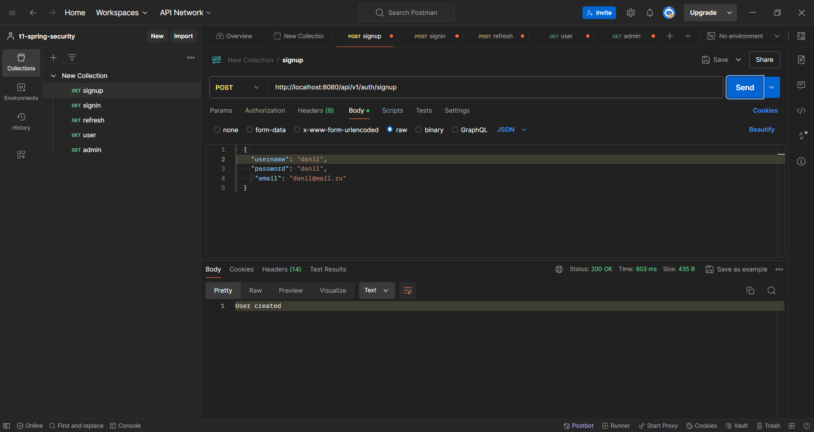
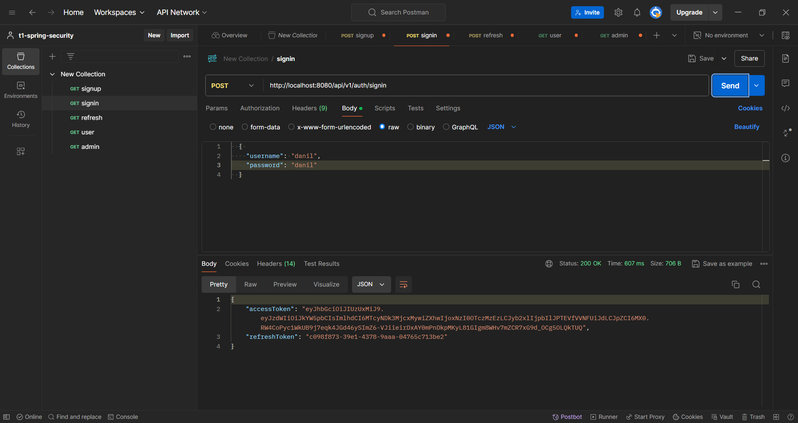
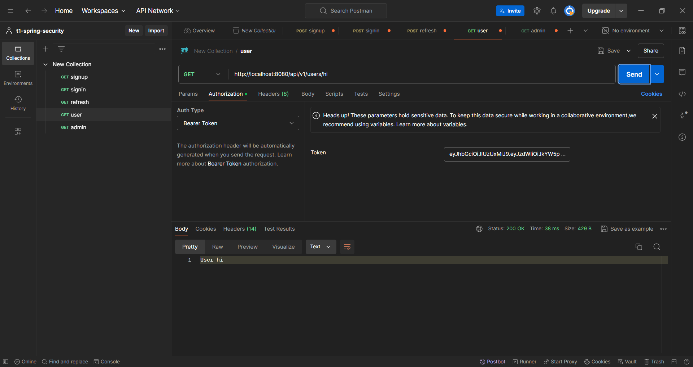
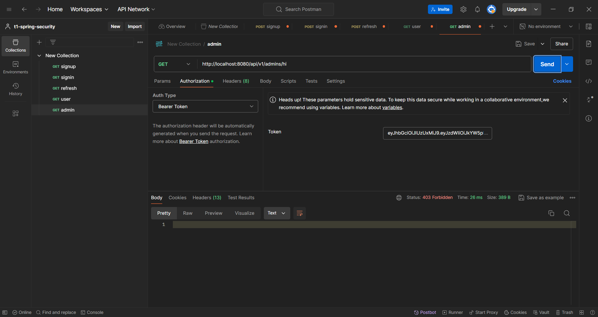

# T1 Spring Security

Данное приложение представляет собой демонстрацию полученных навыков работы со Spring Security с использованием JWT.

## Функционал

Приложение предоставляет возможность:

- Аутентификации
- Авторизации
- Регистрации

Для демонстрации авторизации были созданы две роли:

- ROLE_USER
- ROLE_ADMIN

и соответствующие API для их демонстрации.

Документация по API доступна по следующей ссылке: http://localhost:8080/swagger-ui.html

Для всех регистрирующихся пользователей выдается дефолтная роль ROLE_USER.

Если время жизни Access токена истекло, то с помощью Refresh токена можно его обновить.

## Демо

Примеры использования приложения представлены на скриншотах:

### Регистрация:

### Логин:

### Доступ к user api:

### Доступ к admin api:

## Запуск приложения

Для корректной работы приложения необходимо:

1. Установить PostgreSQL
2. Создать базу данных с именем security
3. После настройки базы данных, приложение готово к запуску